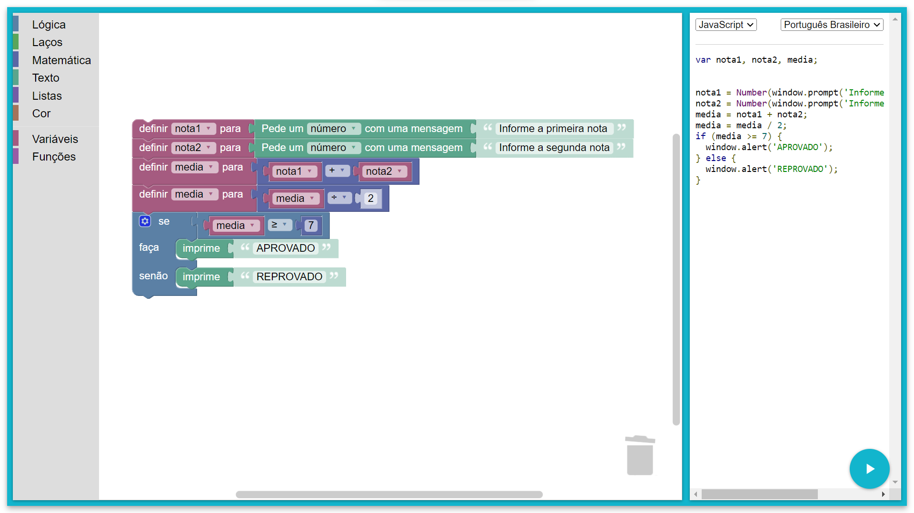

```javascript
var nota1, nota2, media;


nota1 = Number(window.prompt('Informe a primeira nota '));
nota2 = Number(window.prompt('Informe a segunda nota'));
media = nota1 + nota2;
media = media / 2;
if (media >= 7) {
  window.alert('APROVADO');
} else {
  window.alert('REPROVADO');
}
```
