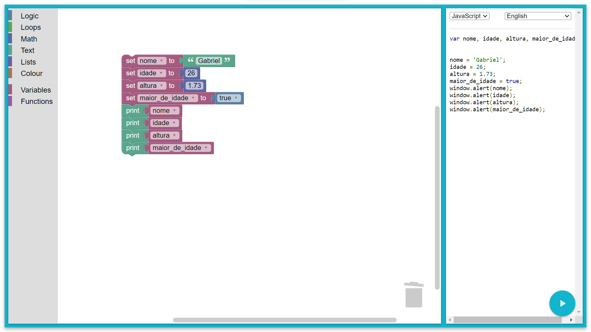

```
var nome, idade, altura, maior_de_idade;


nome = 'Gabriel';
idade = 26;
altura = 1.73;
maior_de_idade = true;
window.alert(nome);
window.alert(idade);
window.alert(altura);
window.alert(maior_de_idade);
```
