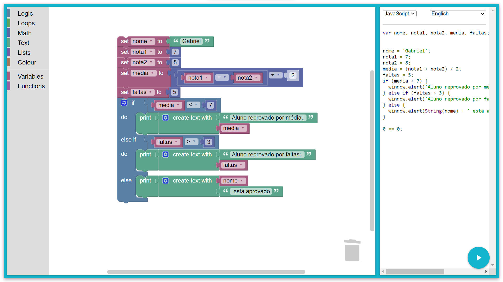

```
var nome, nota1, nota2, media, faltas;


nome = 'Gabriel';
nota1 = 7;
nota2 = 8;
media = (nota1 + nota2) / 2;
faltas = 5;
if (media < 7) {
  window.alert('Aluno reprovado por média: ' + String(media));
} else if (faltas > 3) {
  window.alert('Aluno reprovado por faltas: ' + String(faltas));
} else {
  window.alert(String(nome) + ' está aprovado');
}

0 == 0;
```
