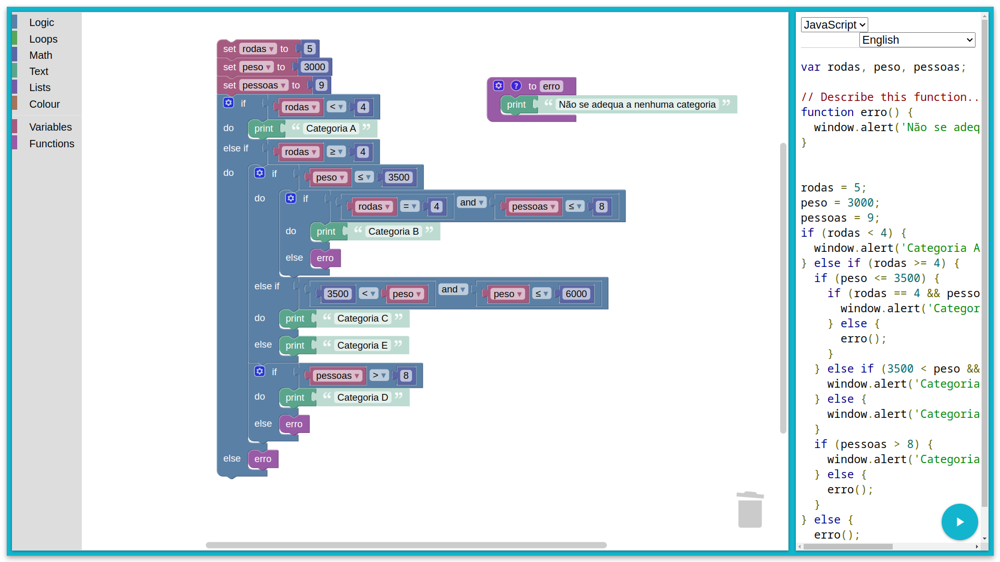

```
rodas <= 2 => A
rodas == 4 && peso <= 3500 && pessoas <= 8 => B
rodas >= 4 && 3500 <= peso <= 6000 => C
rodas >= 4 && 6000 <= peso => E
rodas >= 4 && pessoas > 8 => D
```

```JavaScript

var rodas, peso, pessoas;

// Describe this function...
function erro() {
  window.alert('Não se adequa a nenhuma categoria');
}


rodas = 5;
peso = 3000;
pessoas = 9;
if (rodas < 4) {
  window.alert('Categoria A');
} else if (rodas >= 4) {
  if (peso <= 3500) {
    if (rodas == 4 && pessoas <= 8) {
      window.alert('Categoria B');
    } else {
      erro();
    }
  } else if (3500 < peso && peso <= 6000) {
    window.alert('Categoria C');
  } else {
    window.alert('Categoria E');
  }
  if (pessoas > 8) {
    window.alert('Categoria D');
  } else {
    erro();
  }
} else {
  erro();
}`

```


