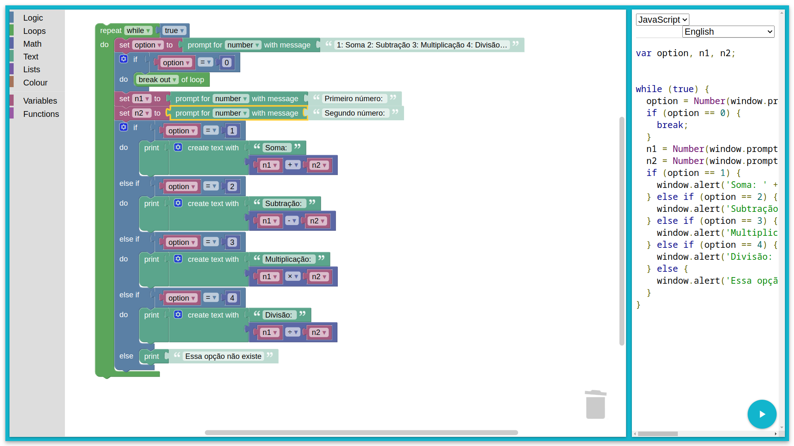

```javascript
var option, n1, n2;


while (true) {
  option = Number(window.prompt('1: Soma 2: Subtração 3: Multiplicação 4: Divisão 0: Sair'));
  if (option == 0) {
    break;
  }
  n1 = Number(window.prompt('Primeiro número: '));
  n2 = Number(window.prompt('Segundo número: '));
  if (option == 1) {
    window.alert('Soma: ' + String(n1 + n2));
  } else if (option == 2) {
    window.alert('Subtração: ' + String(n1 - n2));
  } else if (option == 3) {
    window.alert('Multiplicação: ' + String(n1 * n2));
  } else if (option == 4) {
    window.alert('Divisão: ' + String(n1 / n2));
  } else {
    window.alert('Essa opção não existe');
  }
}

```